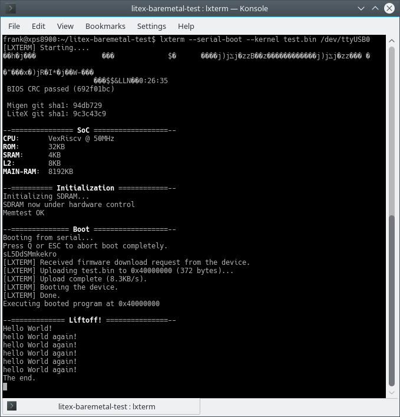

# litex-baremetal-test

Ported to MAX1000 by Frank Buss

How to run it: compile it and start the upload process:
```    
lxterm --serial-boot --kernel test.bin /dev/ttyUSB0
```

In a second shell, go to the litex-boards/litex_boards/partner/targets directory and start the FPGA configuration:
    
```
quartus_pgm -m jtag -o "p;soc_basesoc_max1000/gateware/top.sof"
```
or configure it from the GUI programmer. The upload in the first shell will automatically start and you will see something like this:


